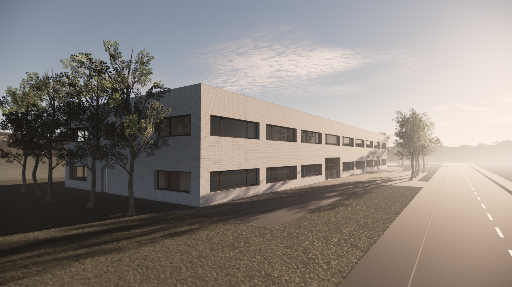
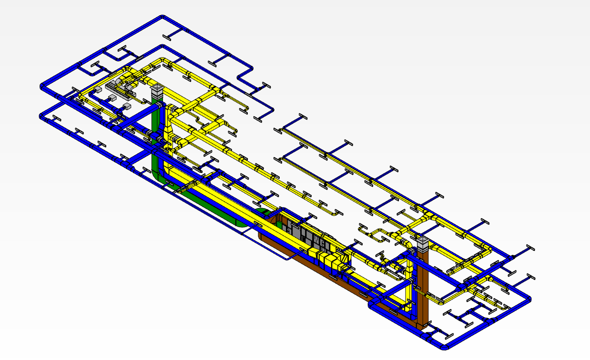
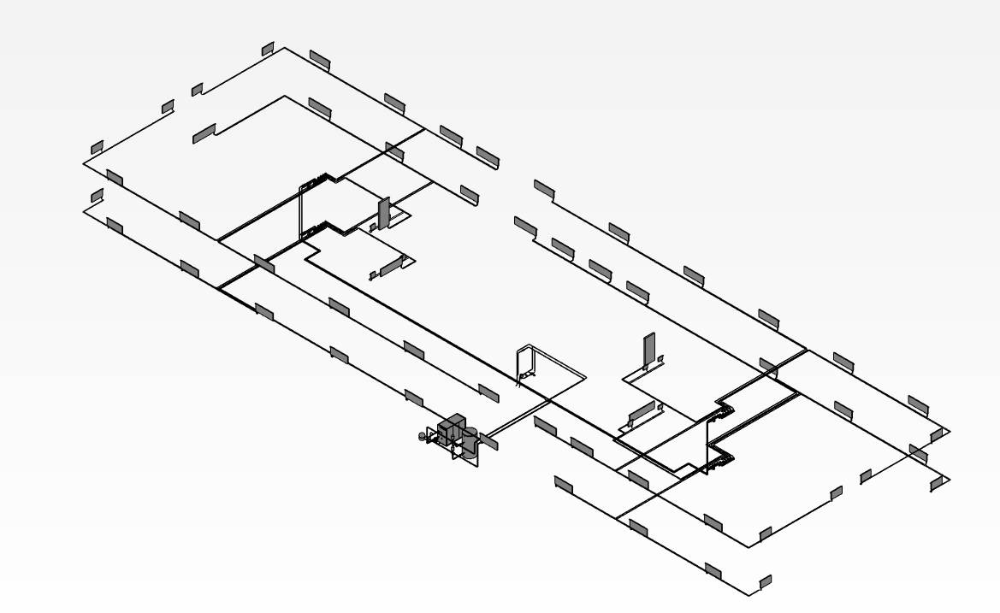
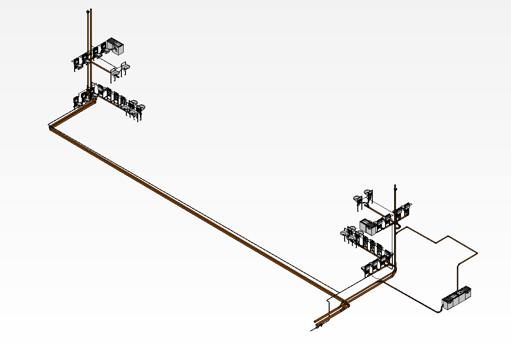
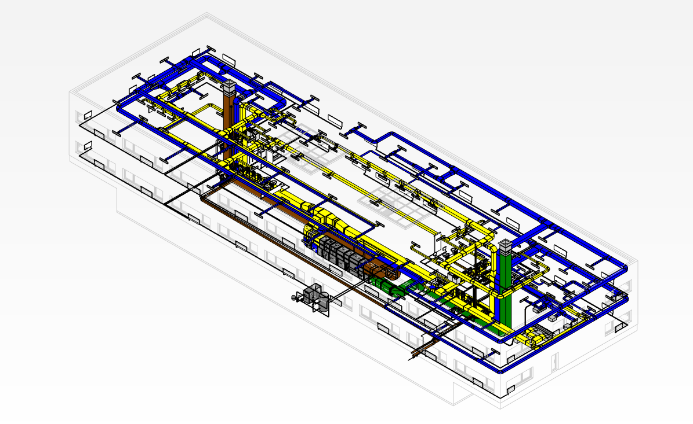
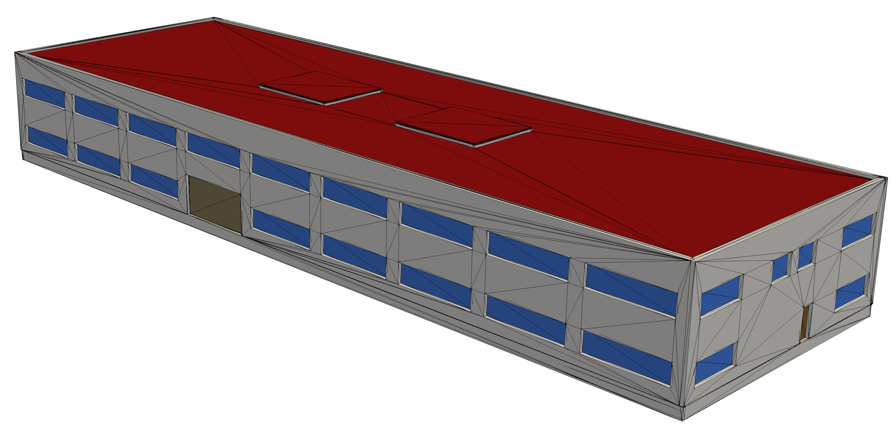

# DigitalHub
Die aktuelle Version V2 von Oktober 2023 finden Sie im Ordner Version_2. Diese ist von Autodesk Revit nach IFC4 Reference View exportiert worden. 

# Modelle

**Fachmodell-ARC**:

**Fachmodell-LFT**:

**Fachmodell-HZG**:

**Fachmodell-SAN**:

**Koordinationsmodell**:

**Vereinfachtes Architekturmodell, ready2mesh für CFD**:
Lässt sich nach Spaces, Ifc-Klassen und einzelnen Objekten filtern

**Mit Space Boundaries angereichertes IFC-Modell. Tool: IFC2SB, e3d**  
Space Boundaries ersten und zweiten Grades

# Reference
